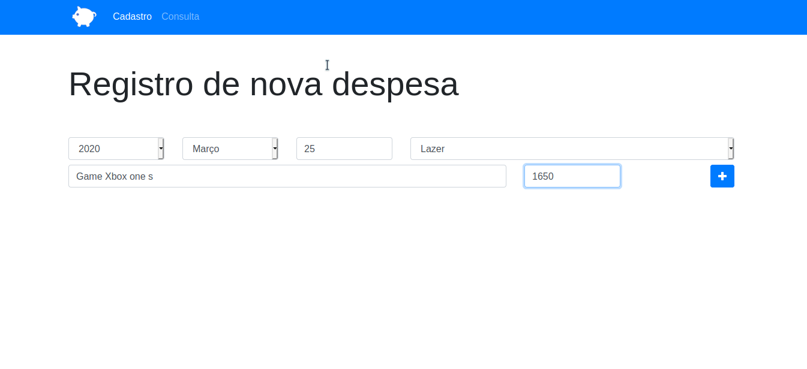
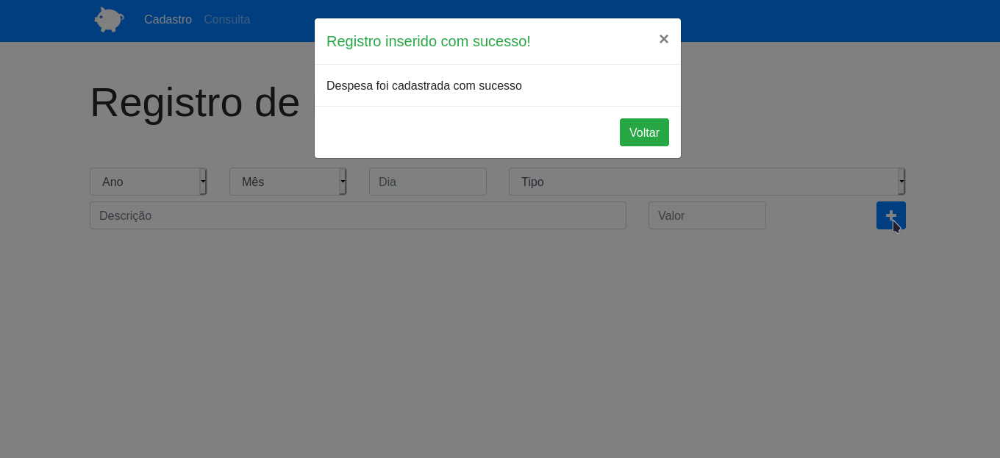
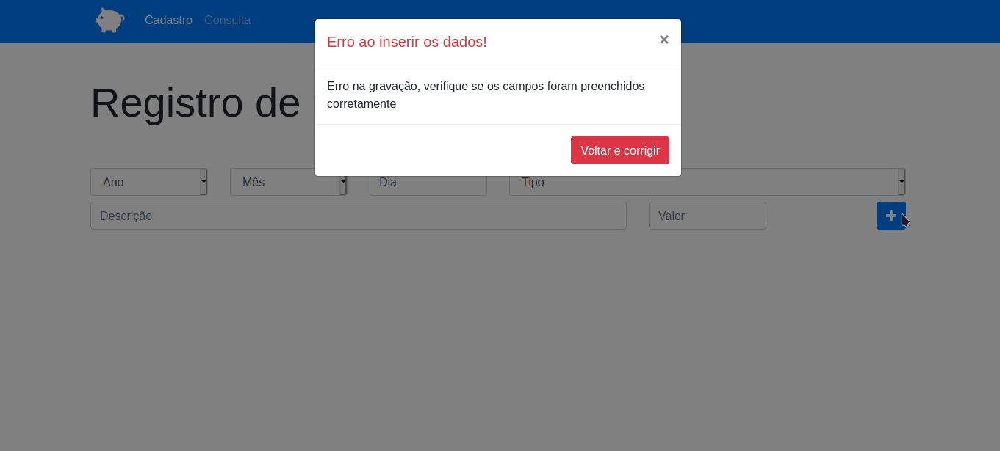
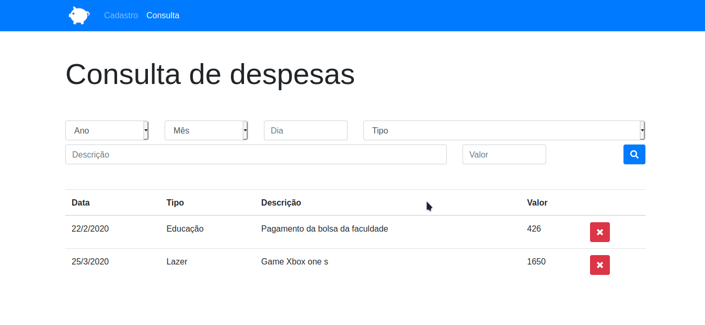

# Projeto_Orcamento-Pessoal 
[link do Projeto](https://hungry-wilson-8a5a0a.netlify.app/)
> Esse Projeto foi feito no Curso de desenvolvimento web no intuito de praticar o javascript.
>
>**Professor** : _Jorge Sant ana_
>
>**Melhorado** : _Vando Dos Reis_

#### Tecnologias usadas
> JavaScript
>
> Html
>
> Css
>
> Bootstrap 4

#### Imagens do projeto

A primeira pagina é a de cadastrar, o usuario preenche todos os campo e depois clica no botão mais para adicionar os dados. Os dados serão adicionados ao localStorage.  

***

Após pressionar o botão, sera aberto um modal alertando que a gravação dos dados foram um sucesso.  

***

Se o usuario esquecer de preencher algum campo o modal avisara, para que o usuario preencha todos os campos, só com os campos preenchidos, os dados serão gravados no localStorage.  

***

A próxima página, é a de consulta, onde o usuario pode consultar os dados que foram adicionado. Note que tem um X sinalizando que o campo pode ser removido.  

***

O usuario tambem pode pesquisar determinada irformação que esteja gravada no localStorage, preenchendo algum campo com a informação, pós ser preenchido será retornado do localStorage a informação que bata com a preenchida.  

***
